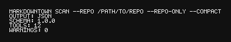

# markdowntown

[](https://github.com/markdowntown/markdowntown-cli/actions/workflows/ci.yml)
[](https://github.com/markdowntown/markdowntown-cli/actions/workflows/checks.yml)
[](https://codecov.io/gh/markdowntown/markdowntown-cli)
[](https://go.dev/)
[](LICENSE)

Monorepo for the Markdowntown CLI + web app. The CLI provides deterministic scanning for AI tool configuration files; the web app provides the UI and services around projects/snapshots.

## Repo layout

- `apps/web`: Next.js web app
- `cli`: Go CLI + LSP + VS Code extension
- `packages/*`: shared packages (when present)

## Docs

- Developer onboarding: `docs/DEV_ONBOARDING.md`
- Monorepo user guide: `docs/USER_GUIDE.md`
- Web app guides: `apps/web/docs/DEV_ONBOARDING.md`, `apps/web/docs/USER_GUIDE.md`
- CLI user guide: `cli/docs/USER_GUIDE.md`

## CLI install

Homebrew (if available):

```bash
brew install markdowntown
brew uninstall markdowntown
```

Build from source:

```bash
cd cli
go build -o bin/markdowntown ./cmd/markdowntown
```

Or install into your Go bin:

```bash
cd cli
go install ./cmd/markdowntown
```

Uninstall (Go install):

```bash
rm "$(go env GOPATH)/bin/markdowntown"
```

## CLI quick start

```bash
markdowntown scan --repo /path/to/repo --repo-only
```

## CLI sync (overview)

The CLI sync flow generates a Workbench handoff link for a repo snapshot. Open the link to review and edit the snapshot in Workbench, then use **Export patch** or **Copy CLI command** to pull changes back to the CLI.

## LSP overlay (VS Code)

One command to build and launch the VS Code LSP client (uses the in-memory overlay for unsaved buffers):

```bash
cd cli
make lsp-vscode
```

Requirements: VS Code's CLI in PATH (`code` or `code-insiders`) and Node/npm for the extension build. Use `CODE_BIN=code-insiders make lsp-vscode` to force Insiders, and `scripts/lsp-vscode --dry-run` to preview the launch command.

Automated smoke test (runs the VS Code extension test runner and asserts overlay diagnostics):

```bash
cd cli
make lsp-vscode-test
```

## Web app (apps/web)

Install deps once at the repo root:

```bash
pnpm install
```

Run the dev server:

```bash
pnpm -C apps/web dev
```

Run lint/test/build:

```bash
pnpm -C apps/web lint
pnpm -C apps/web test:unit
pnpm -C apps/web build
```

Audit scan results:

```bash
markdowntown audit --repo /path/to/repo --repo-only --format md
```

Compact JSON output:

```bash
markdowntown scan --compact
```

Generate evidence-backed suggestions (Markdown output):

```bash
markdowntown suggest --client codex --format md
```

Resolve effective instruction chains:

```bash
markdowntown resolve --client codex --repo /path/to/repo
```

Audit conflicts and omissions:

```bash
markdowntown audit --client codex --format json
```

Validate the registry:

```bash
markdowntown registry validate
```

List supported tools:

```bash
markdowntown tools list
```

## Screenshot



## Commands

- `markdowntown scan` scans repo + user roots and emits JSON.
- `markdowntown suggest` emits evidence-backed instruction suggestions.
- `markdowntown resolve` lists the effective instruction chain for a target file.
- `markdowntown audit` analyzes scan output and emits JSON/Markdown issues (conflicts/omissions) with deterministic ordering.
- `markdowntown registry validate` validates the registry JSON (syntax, schema, unique IDs, docs reachability). Exits 1 on failure.
- `markdowntown tools list` emits a JSON array of tools aggregated from the registry.
- `markdowntown --version` prints tool + schema versions.

Run `markdowntown <command> --help` for full flag details.

## Evidence-only suggestions

`suggest` and `audit` are correctness-first: suggestions are emitted only when Tier-0/Tier-1 sources and proof objects are present. Conflicts or missing evidence produce omissions (see `audit`). Use `--explain` to include proof metadata in JSON output.

`--offline` skips all network fetches and uses cached snapshots (XDG data); warnings are emitted for cache misses. `--refresh` forces a fetch by ignoring cached metadata.

Example (Markdown output):

```md
# Suggestions (codex)

- Keep instructions short and self-contained.
  - Sources: https://example.com/docs
```

## Registry discovery

Registry resolution order:

1. `MARKDOWNTOWN_REGISTRY` (explicit file path)
2. `$XDG_CONFIG_HOME/markdowntown/ai-config-patterns.json` (or `~/.config/markdowntown/ai-config-patterns.json`)
3. `/etc/markdowntown/ai-config-patterns.json`
4. `ai-config-patterns.json` next to the executable

If multiple registries are found without an override, the scan fails.

Release archives include `ai-config-patterns.json` next to the binary; keep them together or copy the registry into the XDG config path.

## Suggestion source registry

Suggestion sources are defined in `doc-sources.json` and discovered in this order:

1. `MARKDOWNTOWN_SOURCES` (explicit file path)
2. `$XDG_CONFIG_HOME/markdowntown/doc-sources.json` (or `~/.config/markdowntown/doc-sources.json`)
3. `/etc/markdowntown/doc-sources.json`
4. `doc-sources.json` next to the executable

If multiple source registries are found without an override, the command fails.

Release archives include `doc-sources.json` next to the binary; keep it co-located or move it into the XDG config path.

See `docs/source-registry.md` for the schema and tier definitions.

## Config + cache locations

Suggestion data and cache paths follow the XDG base directory spec:

- Config: `$XDG_CONFIG_HOME/markdowntown` (or `~/.config/markdowntown`)
- Cache: `$XDG_CACHE_HOME/markdowntown` (or `~/.cache/markdowntown`)
- Data: `$XDG_DATA_HOME/markdowntown` (or `~/.local/share/markdowntown`)

Current releases keep evidence in memory per run; on-disk caches will live in the cache/data locations above.

## User-scope roots

Default user roots scanned (unless `--repo-only` is set):

- `CODEX_HOME` (defaults to `~/.codex`)
- `~/.config/Code/User`
- `~/.gemini`
- `~/Documents/Cline/Rules`
- `~/.continue`
- `~/.cursor`
- `~/.claude`

## Global scope (opt-in)

Use `--global-scope` to include system roots (default: `/etc` on Unix-like systems).
Guardrails for global scans:

- `--global-max-files` and `--global-max-bytes` cap traversal (0 = unlimited).
- `--global-xdev` avoids crossing filesystem boundaries.

On Windows, `--global-scope` is unsupported and emits a warning.

## Repo scope (.github)

Repo scanning is pattern-based from the registry — `markdowntown` does **not** scan every file in `.github`.
For Copilot/VS Code coverage, only specific patterns are matched (e.g., `.github/copilot-instructions.md`,
`.github/instructions/*.instructions.md`, `.github/copilot-instructions/**/*.instructions.md`,
`.github/prompts/*.prompt.md`, `.github/agents/*.md`).

## Copilot + VS Code paths

Repo-scope patterns:

- `.github/copilot-instructions.md`
- `.github/copilot-instructions/**/*.instructions.md`
- `.github/instructions/*.instructions.md`
- `.github/prompts/*.prompt.md`
- `.github/agents/*.md`
- `AGENTS.md`

User-scope patterns:

- `~/.copilot/config.json`
- `~/.copilot/mcp-config.json`
- `$XDG_CONFIG_HOME/copilot/config.json`
- `$XDG_CONFIG_HOME/copilot/mcp-config.json`
- `~/.copilot/agents/*.md`
- `~/.config/Code/User/prompts/*.prompt.md`
- `~/.config/Code/User/profiles/*/prompts/*.prompt.md`

Notes:

- VS Code instruction files require settings such as `github.copilot.chat.codeGeneration.useInstructionFiles`,
  `chat.useAgentsMdFile`, and `chat.useNestedAgentsMdFiles`.
- Ordering is undefined when multiple instruction types coexist; treat conflicts as ambiguous.
- Custom instruction locations configured via `chat.instructionsFilesLocations` should be added via `--stdin`.

## Output highlights

Scan output is deterministic and sorted. Top-level fields include:

- `schemaVersion`, `toolVersion`, `registryVersion`
- `repoRoot`, `scanStartedAt`, `generatedAt`, `timing`
- `scans` (roots) and `configs` (matched files)
- `warnings` (non-fatal issues)

See `cli/docs/USER_GUIDE.md` for detailed output schema and examples.

## Audit highlights

- Supports `--format json|md`, `--input <file|->`, and deterministic ordering.
- Exit codes: 0 when no issues at/above `--fail-severity` (default `error`), 1 when threshold met, 2 for fatal errors.
- Redaction modes via `--redact`; non-repo paths use `$HOME/...`, `$XDG_CONFIG_HOME/...`, or `<ABS_PATH_N>` with a `pathId`.
- Filter rules with `--only`/`--ignore-rule`, exclude paths with `--exclude`, and include scan warnings with `--include-scan-warnings`.

Audit rules surface actionable issues such as empty instructions, frontmatter errors, gitignored configs, missing instructions, and required settings.

## Codex CLI niceties

These files are commonly scanned and may show up in results:

- `AGENTS.md` (Codex agent instructions)
- `.codex/skills/` (skill definitions)
- Codex CLI helpers: `/init`, `/prompts`, `/skills`

## Contributing

See `cli/docs/CONTRIBUTING.md` for the full workflow. CI must always be green before merging or releasing changes.
