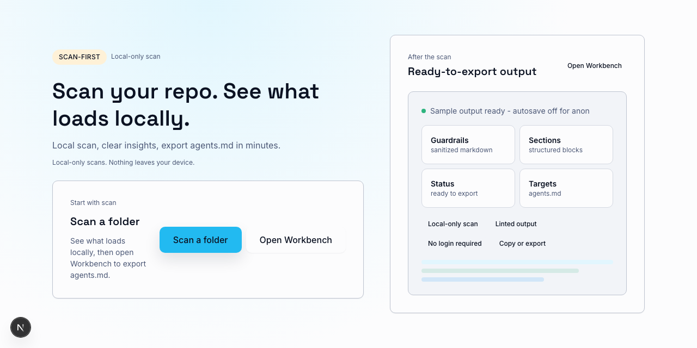
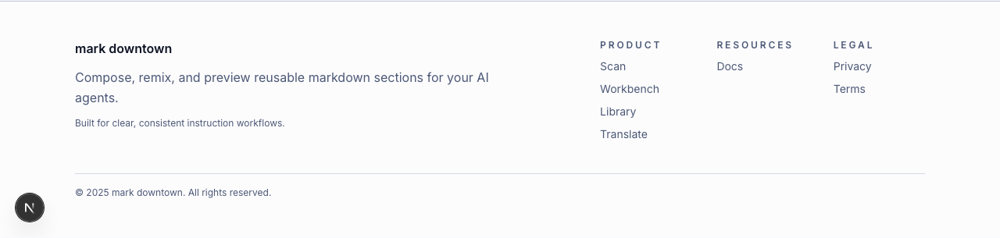
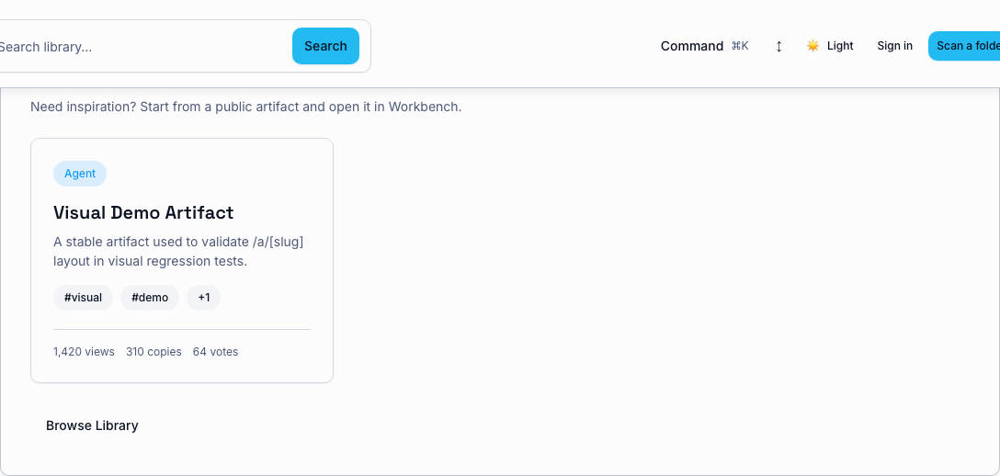

# User Guide

This guide covers three core flows:
- Scan → Workbench → Export
- Library → Workbench → Export
- Translate → Workbench → Export

Scans run locally in your browser and do not upload file contents. Library and Translate use network requests to fetch or compile content, so avoid pasting secrets you do not want sent.

Flow overview: scan a folder → review Next steps → open Workbench with tool + cwd prefilled (scan path).

## Home quick-start (scan-first)
- The home page is optimized for the scan-first path.
- Primary CTA: **Scan a folder** (starts the Atlas Simulator scan).
- Secondary CTA: **Open Workbench** (jump straight into building).
- Tertiary CTA: **Browse Library** (secondary discovery only).

Palette refresh references (CTA hierarchy + footer styling):

Component palette overview:

## Scan → Workbench → Export (6 steps)
1. From Home, click **Scan a folder** (or open the Atlas Simulator directly). Quickstart: `docs/atlas/scan-quickstart.md`.
2. Pick your repo root. If the directory picker is unavailable, use the folder upload input. If you hit a permission error, grant access and retry.
3. Confirm the detected tool + cwd (open **Advanced** only if you need to adjust). Review **Next steps** first, then Instruction health, the ordered list of instruction files, and any warnings. Use **Copy template** or **Refresh results** to fix issues quickly.
4. When you see **Open Workbench** in Next steps, click it. Scan context (tool + cwd) is prefilled so you can build immediately.
5. Add scopes and blocks, then write the instructions you want to ship. Use **Preview** and **Lint** to validate.
6. Export `agents.md` or download the zip and commit the file to your repo.

## Helpful tips
- Use the Instruction health guide for tool-specific checklists: `docs/atlas/instruction-health.md`.
- Use Library to browse public artifacts and open them in Workbench.
- Use Translate to convert between instruction formats for different tools (`docs/translate/quickstart.md`).
- Workbench saves drafts in browser storage; refresh should restore your last session.
- Palette usage guidance: `docs/design/palette-usage.md`.
- Terminology: AGENTS.md refers to a repo file; agents.md is the exported output from Workbench.

## Translate → Workbench → Export (5 steps)
1. Open **Translate** from the main navigation.
2. Select one or more targets (step 1).
3. Paste Markdown or UAM v1 JSON (step 2).
4. Compile and review the output files (step 3).
5. Use **Open in Workbench** to refine, then export `agents.md` or download the zip.

## Library → Workbench → Export (4 steps)
1. Open **Library** and search or filter for a template/snippet.
2. Use the primary **Open in Workbench** action on the card.
3. Review and edit in Workbench as needed.
4. Export `agents.md` or download the zip.

## Edge cases and recovery
- **Directory picker not supported** → use the folder upload input (`webkitdirectory`).
- **Permission error** → re-open the picker and grant access to the repo folder, then retry the scan.
- **Scan truncated** → exclude large folders or scan a narrower subfolder.
- **No instruction files found** → add tool-specific files like `AGENTS.md`, `CLAUDE.md`, `GEMINI.md`, or `.github/copilot-instructions.md`.
- **Library empty** → use **Scan a folder** to generate your first artifact, then return to Library.
- **Translate compile failed** → check targets, retry, and verify you are online.
- **Workbench opened without context** → use **Scan a folder** or **Browse Library** to prefill context, or keep working from scratch.
