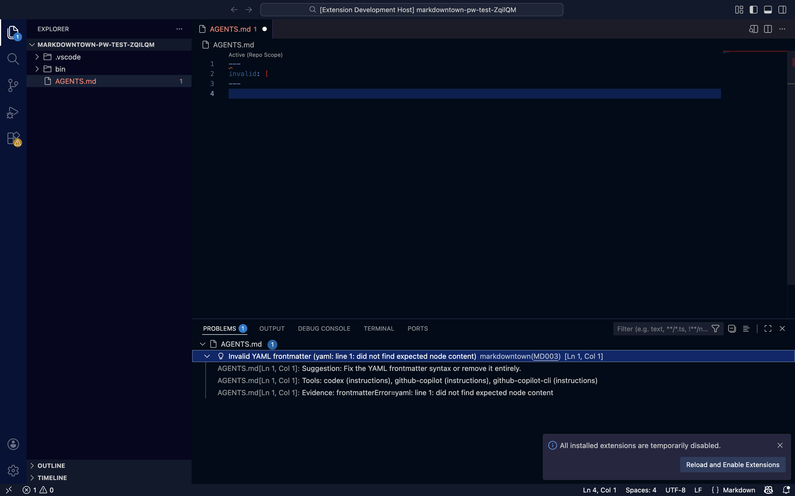

# User Guide (Monorepo)

This guide is the canonical entry point for Markdowntown CLI + web workflows.

## Web app flows

### Scan → Workbench → Export
1. From Home, click **Scan a folder** (Atlas Simulator).
2. Pick your repo root, then review Next steps, warnings, and instruction health.
3. Use **Open Workbench** to launch with tool + cwd prefilled.
4. Add scopes/blocks, write instructions, and validate with **Preview** / **Lint**.
5. Export `agents.md` or download the zip.

### Library → Workbench → Export
1. Open **Library** and select a template.
2. Use **Open in Workbench** to edit.
3. Export `agents.md` or download the zip.

### Translate → Workbench → Export
1. Open **Translate** from the nav.
2. Select targets and paste Markdown or UAM JSON.
3. Compile, review output, then **Open in Workbench**.

## CLI usage
- CLI command + schema details live in `cli/docs/scan-spec-v1.md`, `cli/docs/audit-spec-v1.md`, and `cli/docs/suggest-spec-v1.md`.
- CLI quick reference: `cli/docs/USER_GUIDE.md`.

## VS Code integration
The markdowntown VS Code extension provides real-time diagnostics and quick fixes for AI tooling configuration files.

### Features
- **Real-time Linting**: Surface missing, conflicting, or malformed configs as you type.
- **Quick Fixes**: One-click remediation for common issues (e.g., creating missing repo configs, fixing frontmatter).
- **Metadata Support**: Diagnostics include links to documentation and related information for complex conflicts.

### Settings
| Setting | Default | Description |
| --- | --- | --- |
| `markdowntown.serverPath` | `markdowntown` | Path to the CLI binary. |
| `markdowntown.diagnostics.enabled` | `true` | Toggle real-time diagnostics. |
| `markdowntown.diagnostics.rulesDisabled` | `[]` | List of rule IDs to suppress (e.g., `["MD002"]`). |
| `markdowntown.diagnostics.includeRelatedInfo` | `true` | Show supporting details for diagnostics. |

### Diagnostics in Action

## CLI sync flow
1. Run a CLI sync command to upload or reference a snapshot (see CLI docs).
2. Open the Workbench handoff link (or `/workbench` with `cliRepoId`, `cliSnapshotId`, `cliBranch`, `cliStatus`).
3. Review the snapshot banner, then use **Export patch** or **Copy CLI command** to pull changes back.

## References
- Design system: `docs/DESIGN_SYSTEM.md`.
- Source registry schema: `docs/source-registry.md`.
- Screenshots: `docs/screenshots/cli-sync/`.
