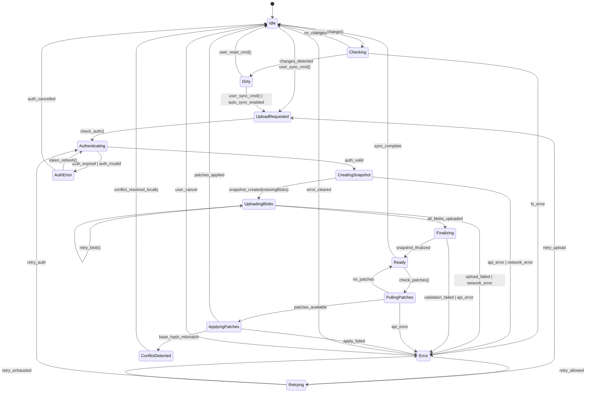

# CLI Sync State Machine

This document defines the state machine for the CLI sync lifecycle and dirty tracking strategy.

## State Machine Diagram



## State Descriptions

### Idle
**Description:** No sync in progress. Watching for changes or waiting for user command.

**Transitions:**
- `detect_change()` → Checking
- `user_sync_cmd()` → UploadRequested

**Actions:**
- File watcher active (if enabled)
- Periodic dirty check (if configured)

### Checking
**Description:** Scanning local files to detect changes since last snapshot.

**Transitions:**
- `no_changes` → Idle
- `changes_detected` → Dirty
- `fs_error` → Error

**Actions:**
- Hash scan of tracked files
- Compare hashes against last snapshot manifest
- Check mtimes for fast detection

### Dirty
**Description:** Local changes detected. Repo needs sync.

**Transitions:**
- `user_sync_cmd()` → UploadRequested
- `auto_sync_enabled` → UploadRequested
- `user_reset_cmd()` → Idle

**Actions:**
- Persist dirty flag
- Show indicator to user (if UI)
- Auto-sync timer (if configured)

### UploadRequested
**Description:** User initiated sync or auto-sync triggered.

**Transitions:**
- `check_auth()` → Authenticating

**Actions:**
- Prepare manifest
- Collect file paths + hashes

### Authenticating
**Description:** Validating CLI token before upload.

**Transitions:**
- `auth_valid` → CreatingSnapshot
- `auth_expired` → AuthError
- `auth_invalid` → AuthError

**Actions:**
- Load token from keyring
- Validate token (check expiry)
- Optionally refresh if near expiry

### AuthError
**Description:** Authentication failed or expired.

**Transitions:**
- `token_refresh()` → Authenticating
- `auth_cancelled` → Idle

**Actions:**
- Prompt for re-auth (device flow)
- Show auth error to user
- Retry with exponential backoff

### CreatingSnapshot
**Description:** Calling `POST /api/cli/snapshots` with manifest.

**Transitions:**
- `snapshot_created(missingBlobs)` → UploadingBlobs
- `api_error` → Error
- `network_error` → Error

**Actions:**
- Send manifest to server
- Receive snapshot ID + missing blob list
- Store snapshot ID for finalize

### UploadingBlobs
**Description:** Uploading missing blobs to server (chunked or direct).

**Transitions:**
- `all_blobs_uploaded` → Finalizing
- `upload_failed` → Error
- `network_error` → Error
- `retry_blob()` → UploadingBlobs (same state)

**Actions:**
- Upload blobs in parallel (bounded concurrency)
- Track progress per blob
- Retry individual blob failures
- Resume from last uploaded blob on restart

### Finalizing
**Description:** Calling `POST /api/cli/snapshots/:id/finalize`.

**Transitions:**
- `snapshot_finalized` → Ready
- `validation_failed` → Error
- `api_error` → Error

**Actions:**
- Notify server all blobs uploaded
- Server validates hashes
- Server marks snapshot ready
- Server triggers scan/audit

### Ready
**Description:** Snapshot successfully synced. Optionally check for patches.

**Transitions:**
- `sync_complete` → Idle
- `check_patches()` → PullingPatches

**Actions:**
- Clear dirty flag
- Update last sync timestamp
- Show success notification

### PullingPatches
**Description:** Checking for pending patches from web edits.

**Transitions:**
- `patches_available` → ApplyingPatches
- `no_patches` → Ready
- `api_error` → Error

**Actions:**
- Call `GET /api/cli/snapshots/:id/patches`
- Filter patches by status=proposed

### ApplyingPatches
**Description:** Applying patches to local files.

**Transitions:**
- `patches_applied` → Idle
- `base_hash_mismatch` → ConflictDetected
- `apply_failed` → Error

**Actions:**
- For each patch:
  - Verify base hash matches local file
  - Apply unified diff
  - Mark patch as applied
- On mismatch: reject patch + notify user

### ConflictDetected
**Description:** Patch cannot be applied due to hash mismatch.

**Transitions:**
- `conflict_resolved_locally` → Idle

**Actions:**
- Mark patch as rejected
- Show conflict to user
- Suggest re-sync after local resolution

### Error
**Description:** Unrecoverable error or retry exhausted.

**Transitions:**
- `error_cleared` → Idle
- `user_cancel` → Idle
- `retry_allowed` → Retrying

**Actions:**
- Log error details
- Show user-friendly error message
- Offer retry or cancel options

### Retrying
**Description:** Attempting to recover from transient error.

**Transitions:**
- `retry_upload` → UploadRequested
- `retry_auth` → Authenticating
- `retry_exhausted` → Error

**Actions:**
- Exponential backoff (1s, 2s, 4s, 8s, ...)
- Max retries: 5
- Track retry count per error type

## Dirty Tracking Strategy

### Detection Methods

#### 1. File Watcher (Preferred)
- Use OS-level file system notifications (fsnotify, inotify, etc.)
- Watch all tracked files/directories
- Mark dirty immediately on change event
- Low overhead, real-time detection

**Pros:**
- Instant change detection
- Low CPU usage

**Cons:**
- May miss changes during downtime
- Platform-specific quirks (symlinks, renames)

#### 2. Hash Scan (Fallback/Verification)
- Periodically compute SHA-256 of all tracked files
- Compare against last snapshot manifest
- Mark dirty if any hash differs

**Pros:**
- Guaranteed correctness
- Works across restarts

**Cons:**
- CPU/IO intensive for large repos
- Not real-time

#### 3. Hybrid Approach (Recommended)
- Use file watcher for real-time detection
- Periodic hash scan (every 5-10 minutes) to verify
- Full hash scan on CLI startup

### Dirty Flag Persistence

**Storage:** `~/.markdowntown/<repo-id>/dirty.json`

```json
{
  "isDirty": true,
  "lastCheckedAt": "2026-01-05T00:00:00Z",
  "changedPaths": ["src/file.md", "docs/spec.md"],
  "reason": "file_changed"
}
```

**Reasons:**
- `file_changed`: Watcher detected change
- `hash_mismatch`: Scan found difference
- `manual_edit`: User explicitly marked dirty

### When to Mark Dirty

1. **File content changed** (hash differs from last snapshot)
2. **File added** (new path not in last snapshot)
3. **File deleted** (path exists in last snapshot but not locally)
4. **File renamed** (detected as delete + add)
5. **File mode changed** (permissions differ)

### When to Clear Dirty

1. **Snapshot finalized successfully**
2. **User runs reset/discard command**
3. **Verification shows no actual changes** (false positive)

### Concurrent Sync Prevention

**Lock file:** `~/.markdowntown/<repo-id>/sync.lock`

```json
{
  "pid": 12345,
  "startedAt": "2026-01-05T00:00:00Z",
  "state": "UploadingBlobs"
}
```

**Behavior:**
- Acquire lock before entering UploadRequested state
- Release lock when returning to Idle
- Check lock on startup; if stale (PID dead), clean up
- Reject concurrent sync attempts with clear error

## Error Handling

### Network Errors
- **Retry:** Yes (exponential backoff)
- **Max retries:** 5
- **User action:** Cancel or wait

### Auth Errors
- **401 Unauthorized:** Token invalid/revoked
  - Retry: No
  - Action: Re-authenticate via device flow
- **403 Forbidden:** Token lacks scopes
  - Retry: No
  - Action: Show error + scope requirements

### Validation Errors
- **400 Bad Request:** Malformed request
  - Retry: No
  - Action: Log details + report bug
- **422 Unprocessable:** Invalid manifest/blob
  - Retry: No
  - Action: Fix local state + re-scan

### Server Errors
- **500 Internal Server Error**
  - Retry: Yes (transient)
  - Action: Exponential backoff
- **503 Service Unavailable**
  - Retry: Yes
  - Action: Wait + retry

### Long-Running Upload Token Refresh

For uploads exceeding token TTL (30 days default):
1. Check token expiry before each blob upload
2. If < 1 day remaining, refresh token proactively
3. Retry blob upload with new token if 401
4. Fallback: Pause upload, prompt user to re-auth

## Auto-Sync Configuration

```json
{
  "autoSync": {
    "enabled": true,
    "delaySeconds": 300,  // Wait 5 minutes after last change
    "requiresNetwork": true,
    "onlyOnWifi": false
  }
}
```

**Behavior:**
- When dirty flag set, start debounce timer
- Reset timer on each subsequent change
- When timer expires, transition Dirty → UploadRequested
- Respect network conditions (optional)

## Future Enhancements

1. **Bandwidth throttling:** Limit upload speed for background sync
2. **Selective sync:** Sync only specific paths/patterns
3. **Conflict resolution UI:** Interactive merge tool
4. **Offline queue:** Store operations for replay when online
5. **Multi-device coordination:** Detect concurrent edits across devices

## Related Docs

- Protocol overview: `docs/architecture/sync-protocol.md`
- Data model: `docs/architecture/cli-sync-data-model.md`
- API spec: `docs/architecture/cli-auth-device-flow.md`
